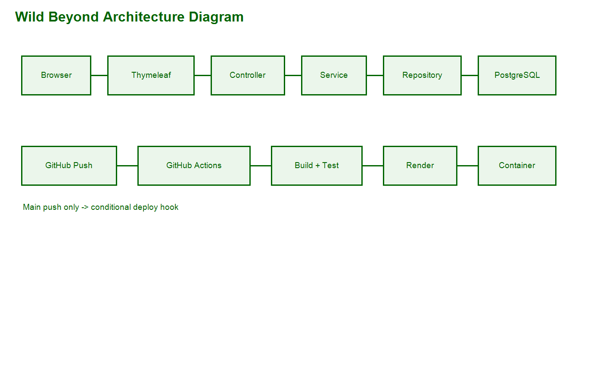
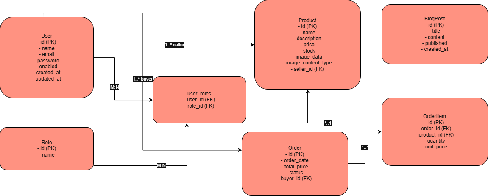
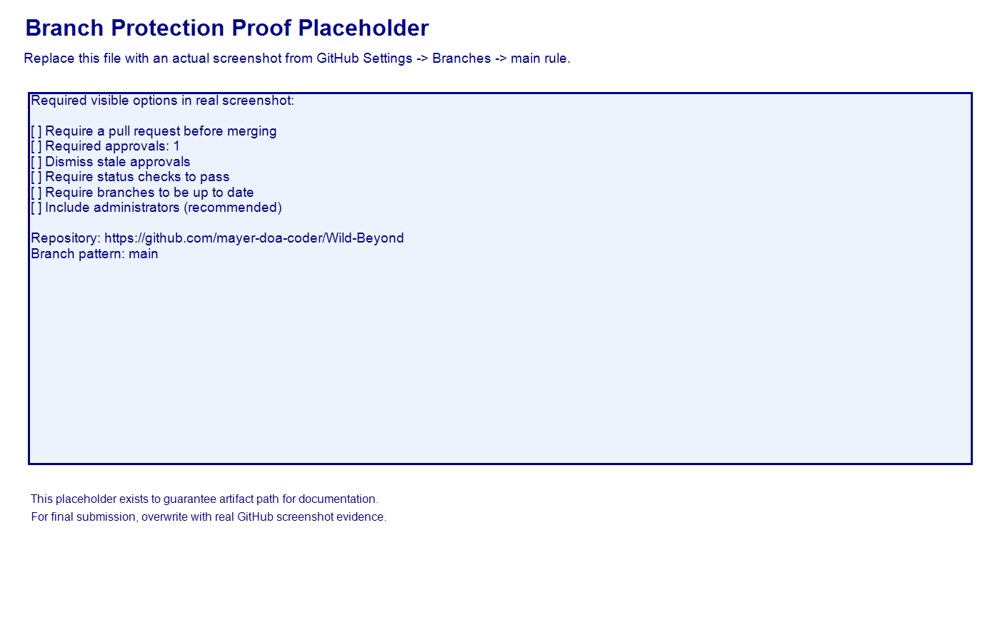

# Wild Beyond

Wild Beyond is a Spring Boot full-stack platform for nature-focused communities.

The platform is designed to support:

- Marketplace: list, browse, and manage wildlife/outdoor related products.
- Explorer Hub: role-based dashboards and user workflows for buyers, sellers, and admins.
- Blog: planned module for editorial and field content in upcoming iterations.

Target users:

- Photographers
- Researchers
- Explorers

## Key Features

- Role-based authentication and authorization (ADMIN, SELLER, BUYER)
- Public product browsing with protected write operations
- REST APIs for products and orders
- Thymeleaf MVC pages for browser workflows
- PostgreSQL persistence with JPA/Hibernate
- Dockerized one-command local startup
- CI/CD with conditional deployment to Render

## Tech Stack

- Java 17
- Spring Boot 4
- Spring Security
- Spring Data JPA
- Thymeleaf
- PostgreSQL
- Docker + Docker Compose
- GitHub Actions
- Render

## Architecture Diagram

System flow:

Browser -> Thymeleaf -> Controller -> Service -> Repository -> PostgreSQL

Deployment flow:

GitHub push -> GitHub Actions (build/test) -> conditional deploy hook -> Render

## ER Diagram

Core entities:

- User
- Role
- Product
- Order
- OrderItem
- BlogPost (optional/planned)

Relationships:

- User <-> Role: many-to-many
- User -> Product: one-to-many (seller owns products)
- User -> Order: one-to-many (buyer places orders)
- Order -> OrderItem: one-to-many
- OrderItem -> Product: many-to-one

## API Endpoints

Current REST API summary:

- GET /api/products
- GET /api/products/{id}
- POST /api/products
- PUT /api/products/{id}
- DELETE /api/products/{id}
- POST /api/orders
- GET /api/orders/my
- GET /api/orders/{id}
- GET /api/orders
- DELETE /api/orders/{id}

Notes:

- /api/users is not implemented as a REST controller in the current MVP. User management is provided via secured MVC routes (/users).
- /api/blog is not implemented in the current MVP.

See detailed API tests: POSTMAN_API_TESTS.md

## Frontend-Backend Route Map

Key connected routes:

- /products -> product listing page
- /products/{id} -> product detail page
- /orders -> role-aware order list page (admin sees all, others see own)
- /users -> admin user management page
- /auth/login and /auth/register -> authentication pages
- /dashboard -> role-based dashboard redirect target

## Run Instructions

See QUICK_START.md for setup and one-command run.

Run flow summary (must match QUICK_START.md):

1. Create .env from .env.example
2. Run docker compose up --build
3. Open http://localhost:8080

## CI/CD Pipeline

GitHub Actions workflow: .github/workflows/ci.yml

- CI runs on push for feature/**, dev, and main
- CI runs on pull requests into dev and main
- Build and tests run before any deployment
- Deployment runs only on push to main after successful build job
- Render deployment is triggered via secure RENDER_DEPLOY_HOOK secret

For full CI/CD details: CI_CD_PIPELINE.md

## Security and Database Polish

- Removed partially wired/incomplete lockout logic to avoid misleading security claims.
- Database schema is managed directly through JPA auto update configuration.

## Links

- Repo: https://github.com/mayer-doa-coder/Wild-Beyond
- Live App: https://wild-beyond.onrender.com

Replace with your actual repository and Render service URLs.

## GitHub Workflow Policy

The main branch is protected to enforce safe collaboration:

- No direct commits to main
- All changes must be submitted through pull requests
- Minimum 1 approval is required before merge
- CI checks must pass before merge
- Branch must be up to date before merge

Required branch protection target:

- Branch pattern: main

Proof artifact:

Detailed manual enforcement steps and verification procedure:

- See docs/GITHUB_BRANCH_PROTECTION_STEPS.md

## Deployment Verification

- [ ] Homepage loads successfully
- [ ] Database connection is healthy
- [ ] Login and registration work
- [ ] Products page and API are accessible
- [ ] Orders can be created with buyer role
- [ ] Main branch push triggers CI and conditional deploy

Example expected verification outcomes:

- Homepage responds at /
- Products API responds at /api/products
- Render deploy hook runs only from main branch pipeline

## Required Submission Artifacts

- README.md
- QUICK_START.md
- POSTMAN_API_TESTS.md
- docs/architecture-diagram.png
- docs/er-diagram.png
- docs/github-branch-protection.png

## Final Review Checklist

- [x] README is structured and complete
- [x] Diagram artifacts are added and embeddable
- [x] Run/deploy docs are aligned with workflow and quick start
- [x] CI/CD conditions are documented clearly
- [x] Evaluator verification path is explicit
